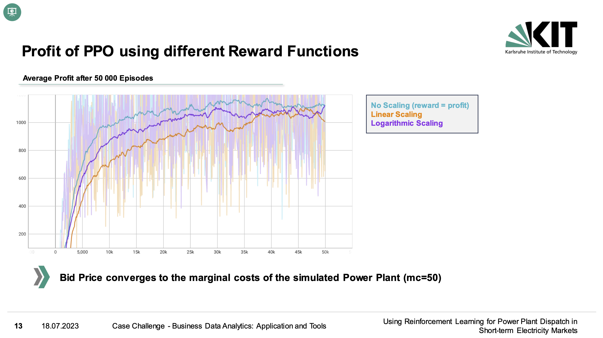
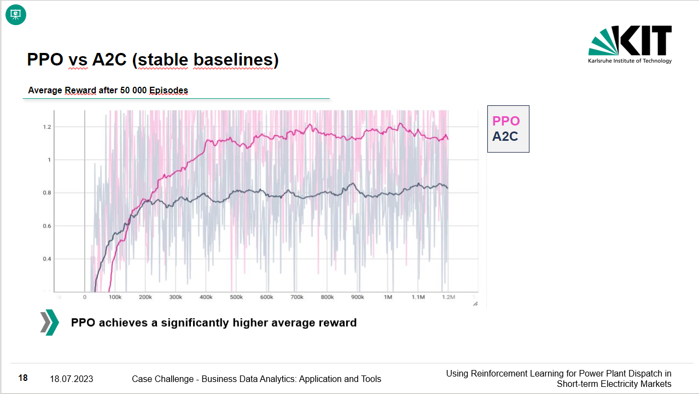

# BDA-Challenge 

# Members
- Skowronek, Louis 2222726
- Karsch, Louis 2100754
- Hartmann, Ingo 1953919
- Röhrle, Dominik 1969773
- Fleck, Leandra 2230564

# Quickstart Guide
1. Create a virtual environment (Python Version 3.11): python -m venv {your_venv_name}

2. Inside the virtual environment install pytorch first (windows):
- pip3 install torch torchvision torchaudio --index-url https://download.pytorch.org/whl/cu117
3. then install the requirements with "pip install -r requirements.txt"

To train the model go inside the folder src

Run python main_ppo.py
The ppo agent is trained. Set train=False to test your model (condition: a model must be saved in models before).

Test coverage: pytest --cov-report term --cov=src tests/

Doc Coverage: docstr-coverage src -i -f

# Here are the results:

