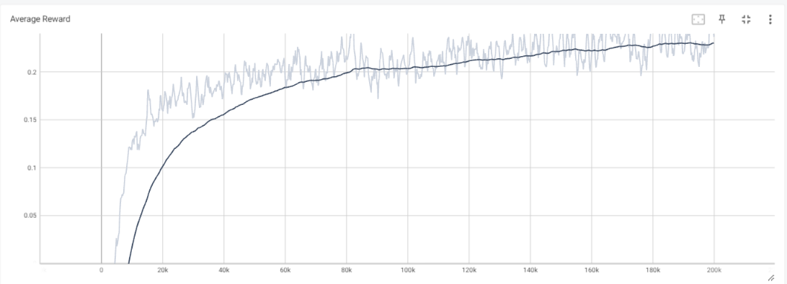
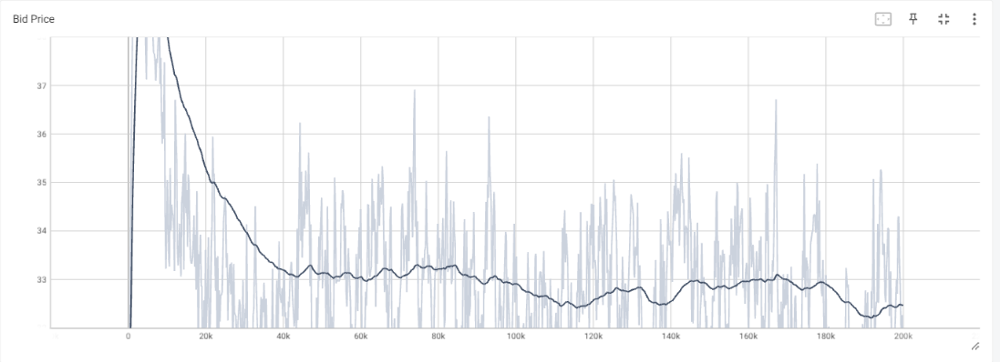
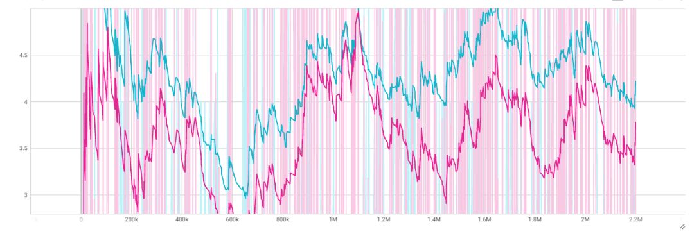

# BDA-Challenge

1. To run the code you need to install pytorch first (windows):
- pip3 install torch torchvision torchaudio --index-url https://download.pytorch.org/whl/cu117
2. then install the requirements.

Then go to src/main.py 
- To run an exisiting model set TRAIN=False
- To train set TRAIN=True

Run python main.py

Here are the current results from tensorboard:

# Average Reward

# Average Bid Price with marginal costs of 30

# Bid Volume and Current Capacity

